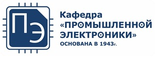
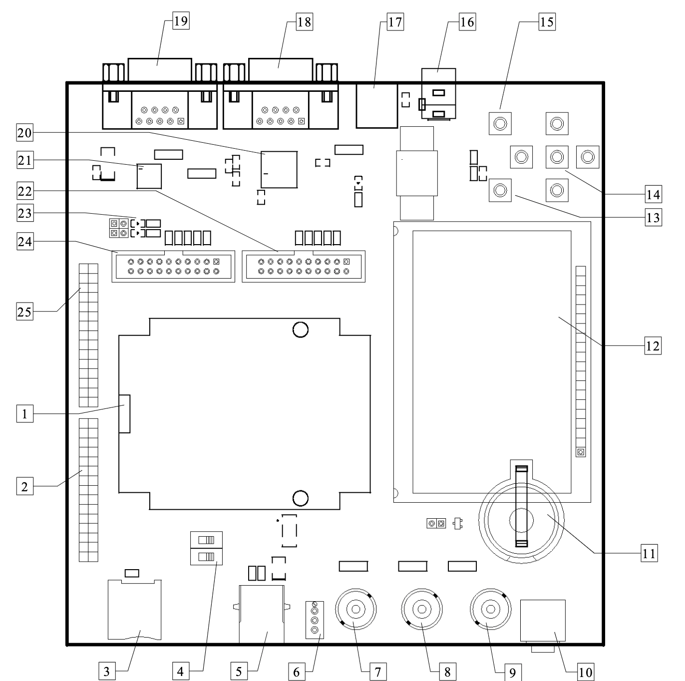

# Курс "Встраиваемые микропроцессорные системы"

Кафедра [Промышленная электроника](https://mpei.ru/Structure/Universe/ire/structure/ie/Pages/default.aspx) [НИУ МЭИ](https://mpei.ru/).

 

## Оглавление

- [Курс "Встраиваемые микропроцессорные системы"](#курс-встраиваемые-микропроцессорные-системы)
  - [Оглавление](#оглавление)
  - [Обзор курса](#обзор-курса)
  - [Цели](#цели)
  - [Предварительные требования](#предварительные-требования)
  - [Структура курса](#структура-курса)
    - [Лекции](#лекции)
    - [Лабораторные работы](#лабораторные-работы)
    - [Экзамен](#экзамен)
  - [Материалы курса](#материалы-курса)
    - [Клонирование проекта](#клонирование-проекта)
  - [Методические пособия](#методические-пособия)
  - [Структура репозитория](#структура-репозитория)
  - [Полезные ссылки](#полезные-ссылки)
  - [Отладочная плата](#отладочная-плата)
  - [Среда разработка](#среда-разработка)

## Обзор курса

Курс предначен для магистров первого года обучения кафедры Промышленной электроники.
Курс знакомит с применение языка C для встраиваемых систем на примере микроконтроллера `К1986ВЕ92QI` (`MDR32F9Q2I`) и
с современными методами разработки встраиваемых микропроцессорных систем.

## Цели

Целями данного курса являются:

- изучение языка программирования C и его применения для встраиваемых
  микропроцессорных систем
- знакомство с микроконтроллером `К1986ВЕ92QI` (`MDR32F9Q2I`)
- изучение современных методов разработки и отладки встраиваемых
  микропроцессорных систем

## Предварительные требования

Студент должен обладать навыками программирования на одном языке высокого уровня,
знать основы микропроцессорной техники и цифровой схемотехники.

## Структура курса

- Лекции
  - Лекция №1: Введение. Язык программирования C
  - Лекция №2: Язык программирования C, применение для встраиваемых систем
  - Лекция №3: Стандартная библиотека языка C
  - Лекция №4: Ядро ARM Cortex-M3. Микроконтроллер К1986ВЕ92QI
  - Лекция №5: Этапы разработки микропроцессорных систем
  - Лекция №6: Разработка и отладка программ для встраиваемых систем
  - Лекция №7: Архитектура программного обеспечения
  - Лекция №8: Периферийные модули: Timer, DMA, ADC, DAC
  - Лекция №9: Периферийные модули: CAN, USB, Ethernet, SDIO
- Лабораторные работы
  - Лабораторная работа №1: Стандартный ввод/вывод на языке С для ПК
  - Лабораторная работа №2: Стандартный ввод/вывод на языке С для МК через UART
  - Лабораторная работа №3: Модуль ЦАП, ПДП и таймер
  - Лабораторная работа №4: Модуль АЦП, ПДП и устройство индикации
- Экзамен

### Лекции

Презентация для лекций №1, №2, №3 доступна в формате `pdf` в директории [lectures](./lectures).

### Лабораторные работы

Лабораторная работа №1 выполняется на персональном компьютере.
Инструкция по запуску компилятора находится в файле `README.md` в директории [labs/lab1_ex](./labs/lab1_ex).

Лабораторные работы №2, №3 и №4 выполняются на отладочной плате `1986EvBrd_BE92Q` с микроконтроллером `К1986ВЕ92QI` (`MDR32F9Q2I`).

В лабораторных работах №2, №3 и №4 активно применяется ввод вывод через последовательный асинхронный
интерфейс `UART`.

> Выполнение лабораторных работ предполагает предварительную
> самостоятельную подготовку: создание проекта и написание исходных текстов программы.

### Экзамен

Курс заканчивается устным экзаменом.
Билет состоит из двух теоретических вопросов и одной задачи на программирование на языке C.

## Материалы курса

Материалы курса размещены на [GitHub](https://github.com),
который является большим хранилищем программ (исходных текстов)
под управлением системы контроля версий `git`.

Репозиторий непрерывно обновляется и поэтому рекомендуется "подтягивать" изменения.

Приветствуется поиск ошибок и неточностей в этом репозитории.
Если вы нашли неточность, то можете создать `pull request` на добавление ваших изменений.

Если вы не знакомы с `git`, то можете периодически скачивать архив проекта.

Освоение системы контроля версий `git` не входит в данный курс,
однако рекомендуется ознакомится с `git`, а также с проектами для встраиваемых
систем, находящимися на [GitHub](https://github.com).
Примером является
[Стандартная библиотека периферии для МК семейства 1986x](https://github.com/eldarkg/emdr1986x-std-per-lib),
которая активно используется в данном курсе, а также
[примеры и документация для нее](https://github.com/eldarkg/emdr1986x-std-per-lib-doc).

### Клонирование проекта

```bash
git clone https://github.com/smirnovalnik/embedded-systems-course.git
```

## Методические пособия

- _Elicia White "Making Embedded Systems: Design Patterns for Great Software"_
- _Joseph Yiu "The Definitive Guide to ARM® Cortex®-M3 and Cortex®-M4 Processors"_
- Для обучения программированию на языке C обязательна к прочтению и **решению всех упражнений** книга
_Керниган Б., Ритчи Д. "Язык программирования C" 2-е издание._

## Структура репозитория

Перечень директорий репозитория:

- [docs](./docs) - документация на микроконтроллер и на отладочную плату
  - [evaluation_board](./docs/evaluation_board/) - документация по отладочному плате `1986EvBrd_BE92Q`
  - [indicators](./docs/indicators/) - документация по индикаторам для лабораторной работы №4
  - [mcu](./docs/mcu/) - документация (datasheets) по микроконтроллеру `К1986ВЕ92QI` (`MDR32F9Q2I`)
- [labs](./labs/) - примеры лабораторных работ
  - [lab1_ex](./labs/lab1_ex/) - примеры лабораторной работы №1, выполняемой на персональном
    компьютере. В примерах показано применение языка C и
    средств стандартного ввода вывода,
    а также средств компиляции программы на персональном компьютере
  - [lab2_ex](./labs/lab2_ex/) - пример лабораторной работы №2, выполняемой на микроконтроллере.
    В примере показано использование языка C и средств стандартного ввода вывода
    уже на микроконтроллере через интерфейс `UART` в интегрированной среде разработки `Keil uVision`.
  - [lab3_ex](./labs/lab3_ex/) - пример лабораторной работы №3, в которой изучается модуль цифро-аналогового преобразователя
    (`ЦАП` или `DAC`) и контроллер прямого доступа (`ПДП` или `DMA`) к памяти. В примере производится генерация
    сигнала произвольной формы на выходе микроконтроллера
  - [lab4_ex](./labs/lab4_ex/) - в лабораторной работе №4 продолжается изучение периферии
    микроконтроллера (`АЦП`, `SPI`, `таймер`). Показан пример измерения аналогового
    сигнала на входе микроконтроллера и вывод результата на жидко-кристаллический индикатор
- [lectures](./lectures/) - слайды и тексты программ, использованные на лекциях
- [programs](./programs/) - программы для установки

## Полезные ссылки

- [Материалы курса «Микропроцессорные устройства»](https://github.com/smirnovalnik/microprocessor-units-course)
- [Интегрированная среда разработки MDK-Lite Edition. Версия для обучения](http://www2.keil.com/mdk5/editions/lite)
- [Ответы на все вопросы по языку C](https://stackoverflow.com/)

## Отладочная плата



| | Описание |
|-|-|
|  1 | Контактирующее устройство (`ZIF панель`) для микроконтроллера `К1986ВЕ92QI` (`MDR32F9Q2I`) |
|  2 | Разъем Х27 портов A,E,F микроконтроллера |
|  3 | Разъем карты памяти microSD |
|  4 | Переключатели выбора режима загрузки |
|  5 | Разъем USB-B |
|  6 | Подстроечный резистор на 7-м канале АЦП |
|  7 | Разъем BNC внешнего сигнала на 7-м канале АЦП |
|  8 | Разъем BNC внешнего сигнала на 1-м входе компаратора |
|  9 | Разъем BNC выхода ЦАП1 |
| 10 | Разъем Audio 3.5мм выхода ЦАП1 через звуковой усилитель|
| 11 | Батарея 3.0В |
| 12 | ЖК индикатор 128х64 |
| 13 | Кнопка WAKEUP |
| 14 | Кнопки UP, DOWN, LEFT, RIGHT, SELECT |
| 15 | Кнопка RESET |
| 16 | Разъем питания 5В |
| 17 | Фильтр питания |
| 18 | Разъем RS-232 |
| 19 | Разъем CAN |
| 20 | Приемо-передатчик RS-232 5559ИН4 |
| 21 | Приемо-передатчик CAN 5559ИН14 |
| 22 | Разъем отладки JTAG-B |
| 23 | Набор светодиодов на порте C |
| 24 | Разъем отладки JTAG-А |
| 25 | Разъем Х26 портов B,C,D микроконтроллера |

## Среда разработка

Разработка программ для микроконтроллера проводится
в интегрированной среде разработки (IDE)
[Keil MDK Lite Edition](http://www2.keil.com/mdk5/editions/lite).
Для загрузки потребуется регистрация на сайте Keil.
Эта версия обладает практически полной функциональностью профессиональной версии,
но с ограничением на размер скомпилированной программы в 32 кБ.
Для лабораторных работ данного курса этого более чем достаточно.

В `Keil MDK Lite Edition` есть симулятор, поэтому работу некоторых частей программы
можно проверить без отладочной платы. Однако данный симулятор поддерживает
только центральный процессор, но не периферийные модули микроконтроллера.

`Keil MDK Lite Edition` изначально ничего не знает о микроконтроллерах
 `К1986ВЕ92QI` (`MDR32F9Q2I`). Поэтому потребуется установить пакет
[mdr_spl_v1.5.3.pack](./programs/mdr_spl_v1.5.3.pack).
После установки данного пакета при создании проекта можно будет выбрать
микроконтроллер `К1986ВЕ92QI` (`MDR32F9Q2I`). В среде появится возможность
добавлять модули из *Стандартной библиотеки периферии для МК семейства 1986x (SPL)*,
а также модули от компании `ARM`.
Сведения об применении *Стандартной библиотеки периферии (SPL)* можно получить из
[примеров](https://github.com/eldarkg/emdr1986x-std-per-lib-doc).
