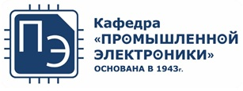
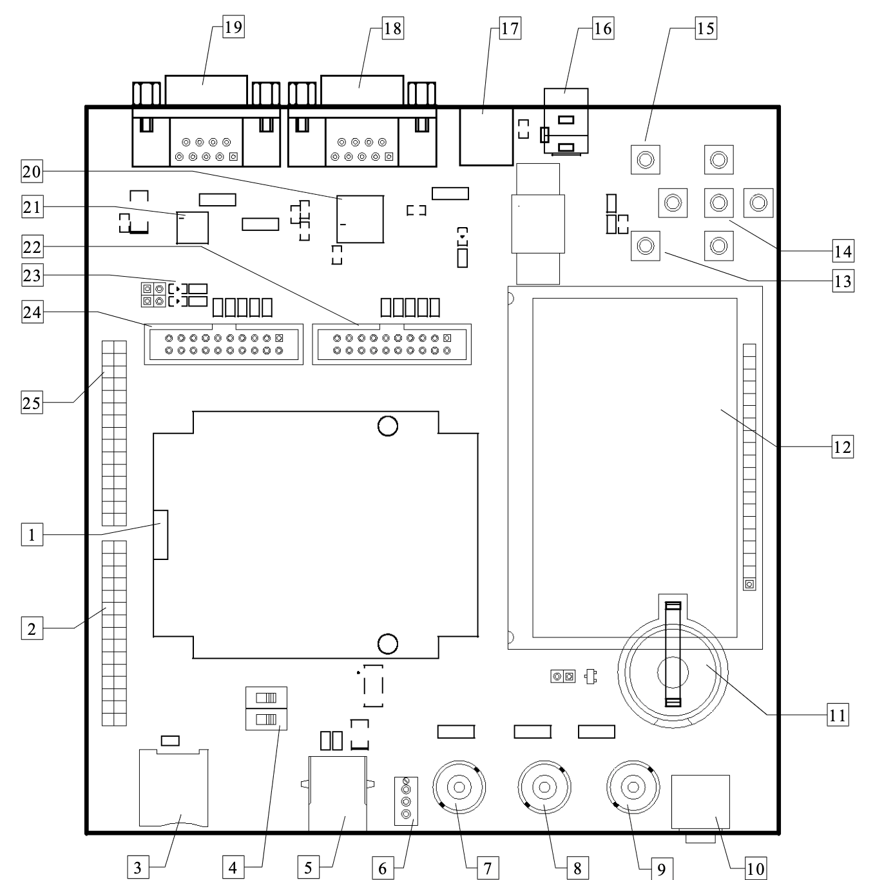

# Embedded Systems Course

The Department of [Industrial Electronics](https://mpei.ru/Structure/Universe/ire/structure/ie/Pages/default.aspx) of [Moscow Power Engineering Institute](https://mpei.ru/).

 

## Content

- [Embedded Systems Course](#embedded-systems-course)
  - [Content](#content)
  - [Instructors](#instructors)
  - [Course Description](#course-description)
  - [Learning Objectives](#learning-objectives)
  - [Prerequisites](#prerequisites)
  - [Course Structure](#course-structure)
    - [Lectures](#lectures)
    - [Labs](#labs)
    - [Exam](#exam)
  - [Learning Resources](#learning-resources)
    - [Clone Repository](#clone-repository)
  - [List of Repository Directories](#list-of-repository-directories)
  - [Textbooks](#textbooks)
  - [Useful Links](#useful-links)
  - [Evaluation Board](#evaluation-board)
  - [Development Environment](#development-environment)
  - [Feedback](#feedback)

## Instructors

Aleksandr Smirnov

Email: [smirnovalnik@mpei.ru](mailto:smirnovalnik@mpei.ru)

Labs are in the room E-101a.

## Course Description

The course is created for first-year master's students of the Department of Industrial Electronics.
The course introduces the use of the C language for embedded systems on the microcontroller unit `MDR32F9Q2I` and with the latest methods of development of embedded systems.

## Learning Objectives

The objectives of this course are:

- learning the C programming language and its application for embedded systems
- introducing to the microcontroller unit `MDR32F9Q2I`
- learning the latest methods of development and debugging of embedded systems

## Prerequisites

The student must have programming skills at least in one of high-level programming languages,
know the basics of microprocessors and digital circuitry.

## Course Structure

- Lectures
  - Lecture #1: Introduction. C Programming Language
  - Lecture #2: C Programming Language. C Language for Embedded Systems
  - Lecture #3: C Standard Library
  - Lecture #4: ARM Cortex-M3 Core. MDR32F9Q2I Microcontroller Unit
  - Lecture #5: Stages of Embedded Systems Development
  - Lecture #6: Development and Debug of  Embedded Software
  - Lecture #7: Software Architecture
  - Lecture #8: Peripheral Modules: Timer, DMA, ADC, DAC
  - Lecture #9: Peripheral Modules: CAN, USB, Ethernet, SDIO
- Labs
  - Lab #1: Standard I/O in C for PC
  - Lab #2: Standard I/O in C for MCU via UART
  - Lab #3: DAC, DMA and Timer
  - Lab #4: ADC, DMA and Display
- Exam

### Lectures

The slides for lectures #1, #2, #3 are available in `pdf` format in the lectures directory.
These lectures can be used as a short reference for the C language.

The remaining lectures are not available.

### Labs

Performing labs involves preliminary self-preparation:
creating a project and writing the source code.

Lab #1 is performed on a PC.
Instructions for running the compiler are in the `README.md` file in the `labs/lab1_ex` directory.

Labs #2, #3 and #4 are performed on the `1986EvBrd_BE92Q` evaluation board with the `MDR32F9Q2I` microcontroller unit.

I/O is actively used via a serial asynchronous
`UART` interface in labs #2, #3 and #4.

### Exam

The course ends with an oral exam.
The ticket consists of two theory questions and one C programming language exercise.

## Learning Resources

The course materials are hosted on [GitHub](https://github.com),
which is a large repository of programs (source codes)
under version control system `git`.

The repository is constantly updated and therefore it is recommended to `pull` the changes.

If you are not familiar with `git`, you can periodically download the project archive.

It is recommended that you look at projects for embedded
systems hosted on [GitHub](https://github.com).
An example is
[Standard Peripheral Library for 1986x MCU Family](https://github.com/eldarkg/emdr1986x-std-per-lib),
which is actively used in this course, as well as
[examples and documentation for it](https://github.com/eldarkg/emdr1986x-std-per-lib-doc).

### Clone Repository

```bash
git clone https://github.com/smirnovalnik/embedded-systems-course.git
```

## List of Repository Directories

- `docs` - documentation for the microcontroller unit and for the evaluation board
  - `evaluation_board` - documentation for the `1986EvBrd_BE92Q` evaluation board
  - `indicators` - documentation on indicators for lab #4
  - `mcu` - documentation (datasheets) for the `MDR32F9Q2I` microcontroller unit
- `labs` - examples of labs
  - `lab1_ex` - examples of lab #1 running on a personal
    computer. The examples show the use of the C language and standard input/output,
    as well as tools for compiling a program on a personal computer
  - `lab2_ex` - an example of lab #2 running on a microcontroller.
    The example shows the use of the C language and standard input/output
    on the microcontroller via the `UART` interface in the `Keil uVision` integrated development environment.
  - `lab3_ex` - an example of lab #3, which studies a digital-to-analog converter
    (`DAC`) and a direct memory access controller (`DMA`). The example generates
    arbitrary waveform at the output of the microcontroller unit
  - `lab4_ex` - in lab #4, the study of the periphery continues
    microcontroller (`ADC`, `SPI`, `timer`). An example of analog measurement is shown.
    Signal from the input of the microcontroller is shown on a liquid crystal indicator
- `lectures` - slides and source codes used in lectures
- `programs` - programs to install

## Textbooks

- _Elicia White "Making Embedded Systems: Design Patterns for Great Software"_
- _Joseph Yiu "The Definitive Guide to ARM® Cortex®-M3 and Cortex®-M4 Processors"_
- If you want to program C language you must read and **solve all exercises** in the textbook
_Kernighan B., Ritchie D. "The C Programming Language" 2nd edition._

## Useful Links

- [Materials of the "Microprocessor Units" course](https://github.com/smirnovalnik/microprocessor-units-course)
- [Answers to all C questions](https://stackoverflow.com/)

## Evaluation Board



| No. | Description |
|-|-|
| 1 | Contact device (`ZIF panel`) for a `MDR32F9Q2I` microcontroller unit |
| 2 | Connector X27 for ports A,E,F microcontroller |
| 3 | microSD card slot |
| 4 | Boot mode selection switches |
| 5 | USB-B connector |
| 6 | Tuning resistor on the ADC channel 7 |
| 7 | BNC connector for external signal on ADC channel 7 |
| 8 | BNC connector for external signal on the first input of the comparator |
| 9 | BNC connector for DAC1 output |
| 10 | Audio connector 3.5mm for DAC1 output via audio amplifier|
| 11 | Battery 3.0V |
| 12 | LCD indicator 128x64 |
| 13 | WAKEUP button |
| 14 | Buttons UP, DOWN, LEFT, RIGHT, SELECT |
| 15 | RESET button |
| 16 | Power connector 5V |
| 17 | Power filter |
| 18 | RS-232 connector |
| 19 | CAN connector |
| 20 | Transceiver RS-232 5559IN4 |
| 21 | Transceiver CAN 5559IN14 |
| 22 | JTAG-B debug header |
| 23 | LEDs on port C |
| 24 | JTAG-A debug header |
| 25 | Connector X26 for ports B,C,D of the microcontroller |

The circuit diagram for the evaluation board is located in the `evaluation_board` directory.

## Development Environment

The development of software for the microcontroller is carried out
in an integrated development environment (IDE)
[Keil MDK Lite Edition](http://www2.keil.com/mdk5/editions/lite).
You will need to sign up on the site to download it.
The installation process is no different from installing any other program for Windows.

This version has almost all the functionality of the professional version,
but with a limit on the size of the compiled code (`32 kB`).
For the labs of this course, this is more than enough.

> :bulb: **Note:** Avoid Russian-language directory names both in the installation path of the IDE and in the paths to your projects. Some components of the development environment may not work properly.

`Keil MDK Lite Edition` has a simulator, so the operation of some parts of the software
can be tested without the evaluation board. However, this simulator supports
only the central processor unit, but not the peripheral modules of the microcontroller unit.

`Keil MDK Lite Edition` initially knows nothing about `MDR32F9Q2I` microcontrollers.
Therefore, you need to install the package
`mdr_spl_v1.5.3.pack`.
After installing this package, when creating a project, you can select
microcontroller `MDR32F9Q2I`. In the environment there will be an opportunity
add modules from the *Standard Peripheral Library for 1986x family MCUs (SPL)*,
as well as modules from the `ARM` company.
Information on using the *Standard Peripheral Library (SPL)* can be obtained from
[examples](https://github.com/eldarkg/emdr1986x-std-per-lib-doc).

## Feedback

If you find errors or typos, please report them via [issues](https://github.com/smirnovalnik/embedded-systems-course/issues) in `GitHub` or write to [smirnovalnik@mpei.ru](mailto:smirnovalnik@mpei.ru).

If you want to improve the content of the repository, you can create a `pull request` to add your changes.
