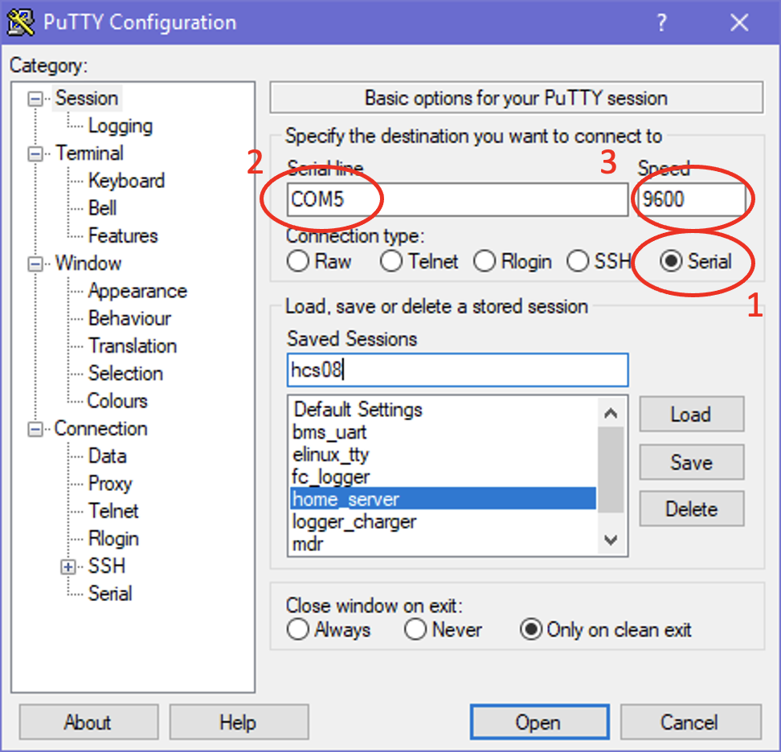
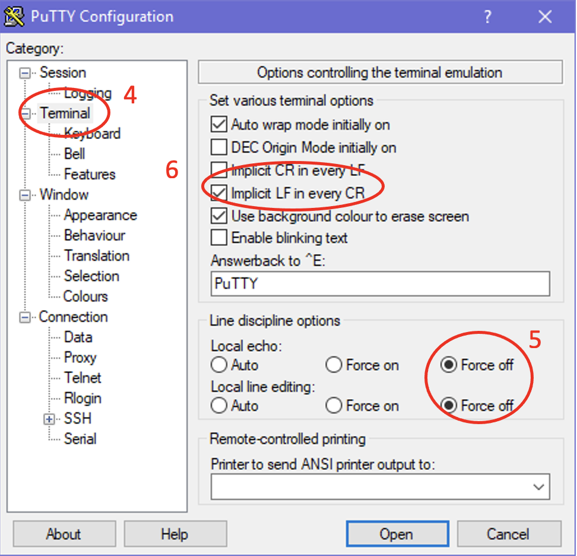
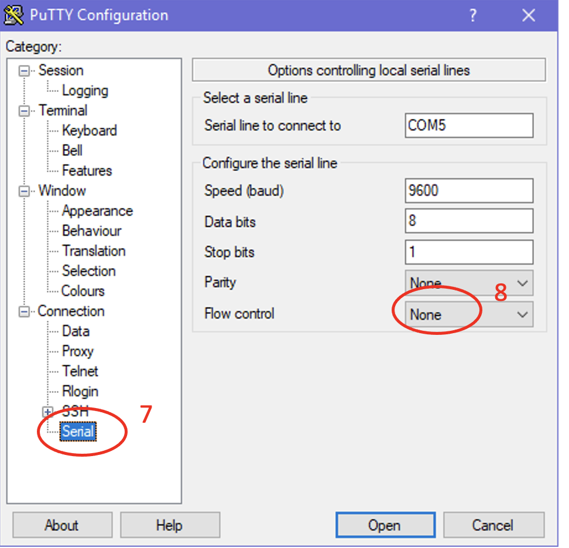

# Пример лабораторной работы 2

Программа подсчитывает количество единиц в двоичном представлении
числа.

Проект создан в среде `Keil MDK Lite Edition` для отладочной платы `1986EvBrd_BE92Q`.

Рекомендуется использовать данный проект как шаблон для задач лабораторной работы №2.

## Подготовка лабораторного стенда

Ввод числа и вывод результата производится в эмуляторе
терминала на персональном компьютере.

Персональный компютер подключен к МК через преобразователь _RS-232-USB_. Один выход этого преобразователя подключен к разъему _RS-232_ отладочной платы, другой – к ПК. Преобразователь _UART-USB_, определяется операционной системой как виртуальный _COM_-порт (_Virtual COM_).

Для считывания поступающих данных на _COM_ порт используется программа эмулятор терминала _PuTTY_.

Параметры программы _PuTTY_ для обмена данными с МК по виртуальному COM порту уже настроены под названием _mdr_.
Запустить сессию можно двойным щелчком на строку _mdr_.

Если по каким-либо причинам не удается соединиться с МК, то следует настроить сессию самостоятельно.

Настройка сессии в программе _PuTTY_:

1. Выбрать вид соединения _Serial port_
2. Установить номер порта в поле _Serial line_. Определить номер порта можно в диспетчере устройств. Он может быть указан как Последовательный интерфейс (_COMx_), где x номер интерфейса.
3. Установить скорость обмена в поле _Speed_ равной _9600_
4. Перейти на вкладку _Terminal_
5. Установить параметр _Local echo_ и _Local line edition_ в _Force off_
6. Установить флажок напротив _Implicit LF in every CR_
7. Перейти на вкладку _Serial_
8. Установить _Flow control_ в _None_
9. Вернуться на вкладку _Session_
10. Сохранить параметры сессии задав имя сессии (например, _mdr_) в поле _Saved Sessions_ и нажать кнопку _Save_
11. Нажать кнопку _Open_

> :bulb: **Примечание:**  В дальнейшем следует подключаться, нажимая двойным щелчком на имя сессии _mdr_.

